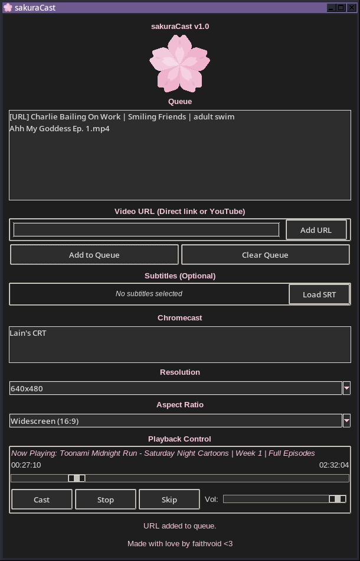

# sakuraCast
### Cast the Planet

Multiplatform casting program written in Python using PyChromecast, with a focus on casting local, YouTube, and online (via files) content in custom aspect ratios (ie; casting 4:3 content properly on 4:3 devices).



## Features:
- Support for custom aspect ratios and video resolutions for local and online videos!
- True 4:3 video support for Chromecast devices connected to 4:3 displays, no more letterboxing! (Select 640x480 + Widescreen for the best results!)
- Queue local and online videos so you can sit back, relax, and marathon your favourite movies and shows hassle-free!
- Casting support from any yt-dlp supported site! (WIP)
- Integrate subtitles directly into any video being cast, including a mode optimized for 4:3 CRTs when set to 640x480!
- Multiplatform support! (Tested in Linux & macOS, should work on Windows!)

## How to use:
- Download the latest release of sakuraCast
- Install ffmpeg if not already installed (macOS: ``` brew install ffmpeg ``` or ``` sudo port install ffmpeg ``` ) (Arch: ``` sudo pacman -S ffmpeg ```) (Debian/Ubuntu: ``` sudo apt install ffmpeg ```)
- Install python-tk, python-pychromecast & yt-dlp (``` pip install pychromecast ``` + ``` pip install tk ``` + ``` pip install yt-dlp ```)
- Open it and select your video file(s) or enter your video URL (URLs that end with file extensions or YouTube only!)
- Select your subtitles, if required
- Select the Chromecast you'd like to cast the video to, and the aspect ratio you'd like to cast in (select 16/9 if you're using a 16/9 display or casting 4:3 content to a 4:3 display, use 4/3 if you're casting 4:3 content to a 16:9 display)
- Select "Cast" and you're all set! This script will detect if you have hardware acceleration and use that to transcode the video, otherwise, will fall back to software transcoding.

## Bugs:
- Seeking is a bit glitchy in the UI, but works. Seeking doesn't work in Google Home, unfortunately.
- Thumbnail image doesn't work in Google Home
- Sometimes stopping a stream requires a restart of the script.

## TODO:
- Fix Google Home images
- Add more customization options for ffmpeg backend
- Add more subtitle options
- Improve video URL + yt-dlp support
- Optimizations and bugfixes
- Implement local music support + online music support via yt-dlp
- Fix cast metadata overall
- Make modifications to run on Android/iOS via their respective Python interpreters(?)
- Implement a webserver for sending files and URLs to(?)
